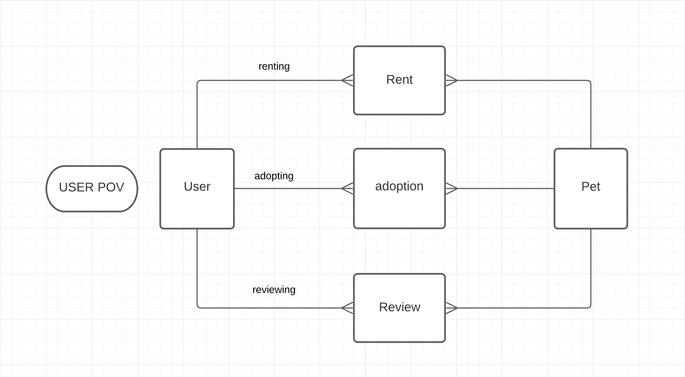

# The Cozy Nation App

The Cozy Nation App is inspired by our cohort's love of dogs and all rescue animals.

The user is presented with a fun platform of pets and not-so-ordinary pets, with several options: 
* Book a Playdate: The user can book a play-date with the cute pet of their choice.
* Adopt: The user can adopt a pet and give him or her their forever home.
* Review: The user can rate and write a review of pets they have booked for play-dates and for pets they have adopted.

The Cozy Nation App implements Ruby on Rails MVC design structures and CRUD functionality.

# Domain-Modeling



***
## Getting Started
To run The Cozy Nation App, you will need to use the terminal on your computer.

```
    git clone https://github.com/Dong-Yi-Xia/Mod2_Project_pets
```

## Installation and Running the Application

After cloning and opening the repository onto your computer, please run the following commands, one at a time, in your terminal:
```
    bundle install
    rails db:migrate
    rails db:seed
    rails s
```
To run the App, type the following into your web browser:
```
    http://localhost:3000/ 
```

## Contributors

Dong Xia

Emmanuel Jose

## Resources

https://unsplash.com/

https://pexels.com/

https://getbootstrap.com/

https://www.w3schools.com/


